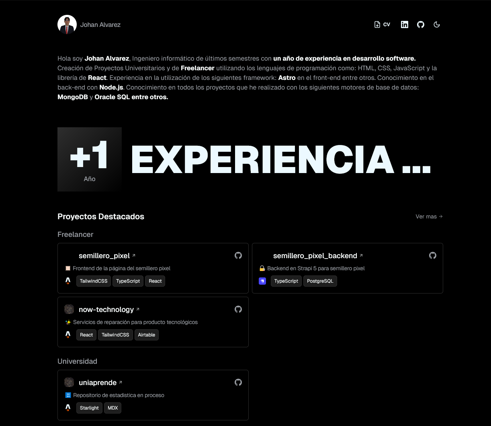

# Portafolio Johan Alvarez 🚀

[Read in English](./README.en.md)

[](https://johan-alvarez.vercel.app)

🌐 **URL del sitio:** [johan-alvarez.vercel.app](https://johan-alvarez.vercel.app/)

Este es mi portfolio personal, construido con Astro, React, TypeScript y TailwindCSS. El sitio muestra mis proyectos, habilidades y experiencia como desarrollador.

## 🛠️ Tecnologías Utilizadas

- **Framework:** [Astro](https://astro.build/) - El framework web para sitios impulsados por contenido
- **Bibliotecas UI:**
  - [React](https://reactjs.org/) - Para componentes interactivos
  - [TailwindCSS](https://tailwindcss.com/) - Para estilos
  - [DaisyUI](https://daisyui.com/) - Biblioteca de componentes
- **Lenguaje:** [TypeScript](https://www.typescriptlang.org/) - Para desarrollo con tipado seguro
- **Gestión de Estado:** [Nanostores](https://github.com/nanostores/nanostores) - Gestión de estado ligera

## 📁 Estructura del Proyecto

```
src/
├── components/     # Componentes UI reutilizables (Astro y React)
├── pages/         # Páginas de rutas
├── sections/      # Secciones de páginas
├── services/      # Lógica de negocio y servicios de datos
└── public/        # Activos estáticos (fuentes, imágenes, PDFs)
```

## 💻 Configuración de Desarrollo

### Prerequisitos

- Node.js (Se recomienda la última versión LTS)
- Gestor de paquetes (npm, yarn, pnpm, o bun)

### Primeros Pasos

1. Clonar el repositorio
```bash
git clone [repository-url]
cd igrisdev-portfolio
```

2. Instalar dependencias
```bash
bun install
# o
pnpm install
# o
yarn install
# o
npm install
```

3. Iniciar servidor de desarrollo
```bash
bun run dev
# o
pnpm run dev
# o
yarn run dev
# o
npm run dev
```

### Scripts Disponibles

- `dev`: Iniciar servidor de desarrollo
- `build`: Crear build de producción
- `preview`: Vista previa del build de producción
- `astro`: Ejecutar comandos de Astro CLI

## ✨ Características

- 🎨 Diseño moderno y responsivo
- 🔒 Desarrollo con tipado seguro usando TypeScript
- ⚛️ Componentes UI interactivos con React
- 🚄 Rápido y optimizado con Astro
- 💫 Animaciones suaves con TailwindCSS
- 🧩 Hermosos componentes UI con DaisyUI

## 📦 Dependencias

### Dependencias Principales
- @astrojs/react - Integración de React para Astro
- @astrojs/vercel - Adaptador de despliegue para Vercel
- react & react-dom - Biblioteca UI
- tailwindcss - Framework CSS utilitario
- lucide-react - Set de iconos modernos
- nanostores - Gestión de estado ligera

### Dependencias de Desarrollo
- daisyui - Biblioteca de componentes para Tailwind CSS
- tailwindcss-animated - Utilidades de animación

## 🚀 Despliegue

Este proyecto está optimizado para despliegue en Vercel:
1. Conecta tu repositorio a Vercel
2. Vercel detectará automáticamente la configuración de Astro
3. Tu sitio se desplegará y actualizará automáticamente con cada push